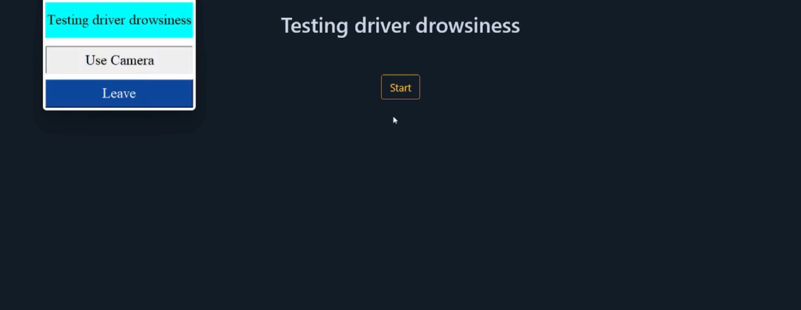

# AlertDrive

Website: [Demo](https://drive.google.com/file/d/1K_Nvkn9M_z9Q7KwOIOaH2vPNcQVlkBCr/view?usp=sharing)

[AlertDrive] is an application to connect using facial recongnition and monitor driver attention.

#### Start drowsiness project
## cd drowsiness

#### install packages
## pip install -r requirement.txt

#### run project 
## python app1.py port 5001

#### start facelogin project
## cd facelogin

#### run project 
## python application.py port 5000

#### workflow application 

1- first make sure that you have create these folders: 
    static/face
    static/face/unknown

2- [localhost:5000](http://127.0.0.1:5000)

3- open the side menu and click on register to create an account 

4- after sign up, open the side menu => click on Face recognition Setup

5- scan your face 

6- go back to login page

7- click Face Password

8- scan your face and enter your username 

Now, if you want to take part in the meeting, make sure you have already logged in. 
And that you are running your server drowsiness [localhost:5001]

9- Once you have logged in, go to the side menu and click on Meeting, then on Start.

10- Now there is menu opened in your desktop, click on "Utiliser webcam" 